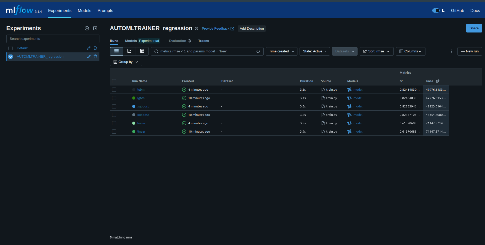
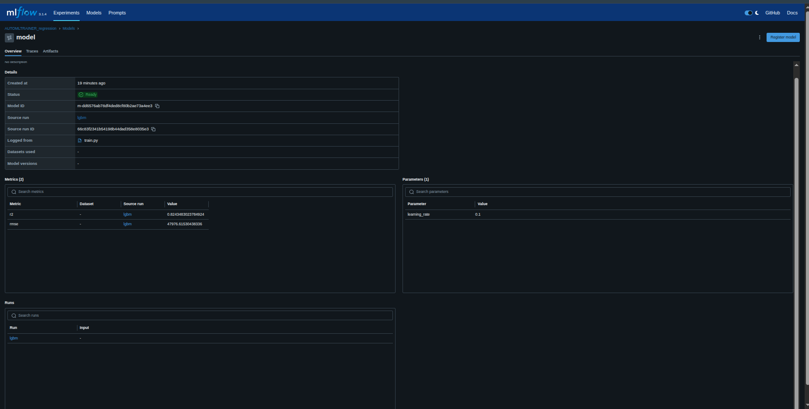

#  AutoTrackML: Automated Model Selection with MLflow Tracking

This project automates the process of:
- Selecting the best regression model
- Tuning hyperparameters
- Tracking experiments using MLflow
- Extracting & saving the best model

---

## 📊 What It Does

- Trains 3 regressors: `LinearRegression`, `XGBoost`, and `LightGBM`
- Uses `GridSearchCV` for hyperparameter tuning
- Logs all experiments to **MLflow**
- Saves best model artifacts to `/model/`

---

## 🧠 Project Structure

| File | Purpose |
|------|---------|
| `src/train.py` | Main script for training all models |
| `src/model_selector.py` | Logic for grid search & logging |
| `src/config.yaml` | Configurable params |
| `mlflow ui` | To view and compare runs |

---

## 📷 MLflow UI Screenshots

### ✅ Logged Runs


### 🔥 Best Model Downloaded


---

## 📦 Run Locally

### 🔹 Step 1: Install requirements
```bash
pip install -r requirements.txt
```

### 🔹 Step 2: Run training

```bash
python -m src.train
```

### 🔹 Step 3: Start MLflow UI

```bash
mlflow ui
```

### Output
- Best model saved in /model/
